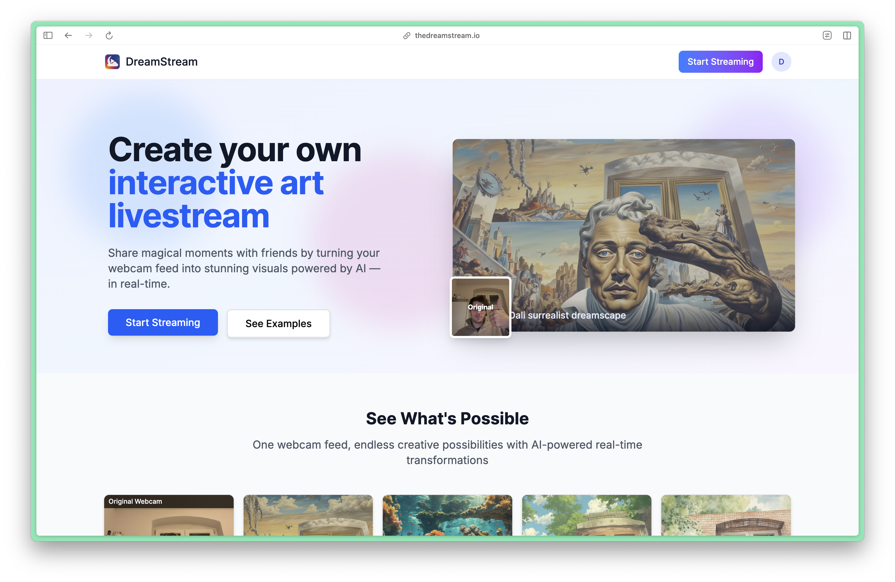
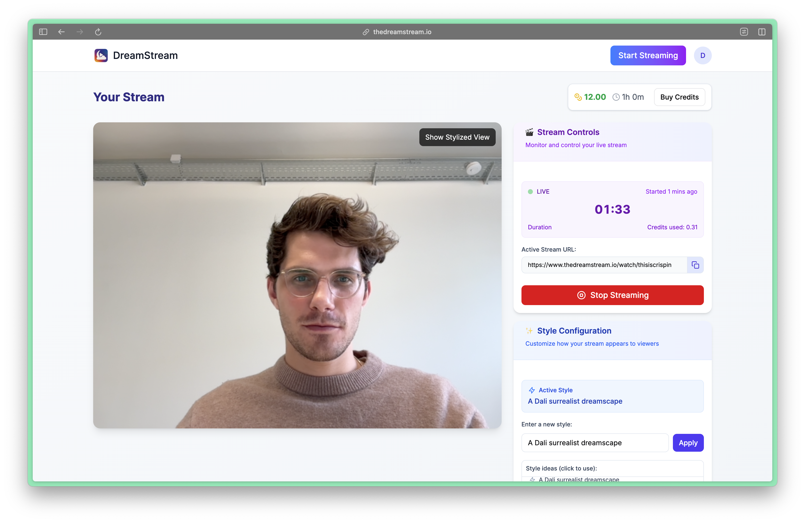

# DreamStream - AI-stylised Video Streaming Platform

DreamStream is a cutting-edge video streaming platform that leverages AI technology to stylize live video streams in real-time. This innovative platform allows users to create and share unique, AI-generated video content, revolutionizing the way we interact with live streaming.

Check it out at [www.thedreamstream.io](https://www.thedreamstream.io/)!

### 1-Week Development Sprint Timeline

The following timeline outlines the key milestones achieved during our 1-week development sprint:

| Date | Goals Achieved |
|------|-----------------|
| Monday | (a) Researched img2img technology and selected a suitable network for implementation ✅ (b) Developed a basic class for style transfer ✅ |
| Tuesday | (a) Designed the infrastructure for live streaming ✅ (b) Created a minimal website with streamer and viewer interfaces ✅ (c) Deployed the website to a live URL and set up continuous deployment ✅ (d) Deployed a basic WebSocket server ✅ (e) Enabled users to create and view live streams via the website ✅ |
| Wednesday | ... |
| Thursday | ... |
| Friday | (a) Deployed the WebSocket server on modal.com for autoscaling capabilities ✅ (b) Integrated image transformations using H100 GPU on modal.com ✅ |
| Saturday | (a) Removed black patches between frames in the stream ✅ (b) Allowed users to specify prompts for image transformations ✅ (c) Optimized the speed of image transformations ✅ |
| Sunday | (a) Integrated lightning diffusion code into the modal.com deployment ✅ (b) Implemented registration and login for streamers ✅ (c) Enabled streamers to purchase credits for streaming via Stripe checkout ✅ (d) Added real screenshots and enhanced the app's UI ✅ |

# 🚀 Features Roadmap

### Upcoming Features

- [ ] Implement real-time chat functionality for each stream
- [ ] Display the number of viewers for each stream to streamers

### Future Development Ideas

- Enable live streaming from raspberry pi devices
- Introduce audio streaming capabilities
- Store input and output images from streams for potential timelapse creation
- Develop an admin dashboard for managing the platform

### Long-term Vision

- Allow users to utilize the platform as middleware for streaming to other platforms (e.g., YouTube, Twitch)
- Explore the possibility of supporting multiple camera streams simultaneously, enabling unique streaming effects not achievable with a single camera

### Product Showcase

Here's a glimpse of what DreamStream can do:

**Stream Example**

 → **Adjusts to the structure of people and movements in your video** → 